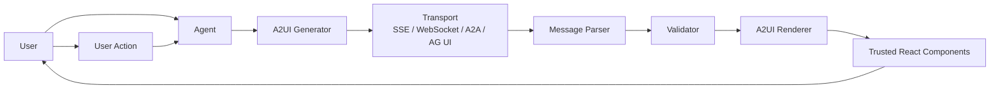
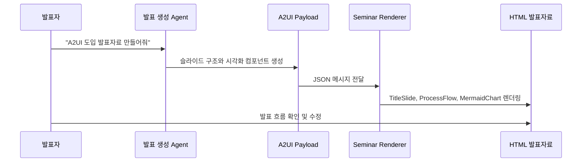
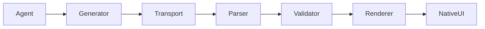

# A2UI 도입 발표 기획서

## 1. 문서 목적

이 문서는 세미나 발표자료로 사용할 수 있도록 A2UI의 개념, 도입 효과, 개발 범위, 구현 로드맵을 정리한 기획서다.
발표의 목표는 단순히 "A2UI라는 기술이 있다"를 소개하는 것이 아니라, 우리 프로젝트가 왜 A2UI 같은 방식을 도입해야 하는지, 그리고 실제 코드에서는 어떤 레이어를 만들게 되는지 설득력 있게 보여주는 것이다.

확인일은 2026-04-16 기준이다.
공개 문서 기준으로 A2UI는 Google이 공개한 Agent-to-User Interface 프로젝트이며, v0.8은 stable, v0.9는 draft로 안내되어 있다.

## 2. 한 줄 정의

A2UI는 AI agent가 HTML이나 JavaScript 코드를 직접 내려보내는 대신, 안전한 JSON 형태의 UI 설명을 보내고, 클라이언트가 자신의 신뢰된 컴포넌트로 렌더링하게 만드는 Agent-to-UI 프로토콜이다.

더 짧게 말하면:

> A2UI는 agent가 "텍스트"만 말하는 것이 아니라, "우리 앱의 디자인 시스템으로 렌더링 가능한 UI 설계도"를 말하게 하는 방식이다.

## 3. 발표 핵심 메시지

이번 발표에서 끝까지 가져갈 메시지는 다음 하나다.

AI agent의 결과물이 텍스트 답변에서 인터랙티브 화면으로 확장될수록, 프론트엔드는 agent가 만든 코드를 실행하는 곳이 아니라, agent의 의도를 안전하게 렌더링하는 곳이 되어야 한다.

A2UI는 이 전환을 위한 형식이다.
agent는 UI의 의도와 구조를 말하고, 클라이언트는 스타일, 보안, 접근성, 상태 관리를 통제한다.
이렇게 역할을 분리하면 agentic UI를 만들 때 가장 까다로운 보안, 디자인 일관성, 프론트엔드 유지보수 문제를 동시에 줄일 수 있다.

## 4. 왜 A2UI가 필요한가

### 4.1 기존 agent UI의 한계

AI agent를 제품에 붙이면 처음에는 대부분 채팅 UI로 시작한다.
사용자가 질문하고, agent가 텍스트로 답한다.
이 방식은 빠르게 만들 수 있지만, 실제 업무 흐름으로 들어가면 곧 한계가 생긴다.

예를 들어 사용자가 다음처럼 요청한다고 하자.

- "이번 달 지출을 카테고리별로 정리해줘."
- "이 고객에게 필요한 입력 폼을 만들어줘."
- "승인해야 할 요청들을 우선순위별로 보여줘."
- "이 데이터 흐름에서 병목 구간을 시각화해줘."

텍스트만으로는 부족하다.
표, 차트, 폼, 버튼, 상태 표시, 필터, 지도, 타임라인, 대시보드가 필요해진다.
즉 agent는 답변을 생성하는 것에서 끝나지 않고, 사용자가 바로 조작할 수 있는 화면을 만들어야 한다.

### 4.2 위험한 해법: agent가 코드를 보내는 방식

가장 단순한 발상은 agent에게 HTML, CSS, JavaScript를 생성하게 하고 프론트엔드에서 실행하는 것이다.
하지만 이 방식은 위험하다.

- 실행 가능한 코드는 보안 경계가 약하다.
- agent가 만든 HTML은 우리 앱의 디자인 시스템과 어긋나기 쉽다.
- 임베드 iframe은 무겁고 앱 안에서 이질적으로 보일 수 있다.
- 접근성, 반응형, 테마, 권한 처리를 매번 다시 해결해야 한다.
- 외부 agent가 만든 UI를 그대로 신뢰하기 어렵다.

즉 "agent가 화면을 만든다"는 방향은 맞지만, "agent가 코드를 실행하게 한다"는 방향은 제품화하기 어렵다.

### 4.3 A2UI의 대안

A2UI는 agent가 코드를 보내지 않게 한다.
대신 agent는 선언형 데이터로 UI를 설명한다.

예를 들어 agent는 이런 의도를 보낼 수 있다.

```json
{
  "surfaceId": "expense-summary",
  "root": "root",
  "components": [
    {
      "id": "root",
      "component": "Card",
      "children": ["title", "chart", "confirm"]
    },
    {
      "id": "title",
      "component": "Text",
      "text": "이번 달 지출 요약"
    },
    {
      "id": "chart",
      "component": "BarChart",
      "data": { "path": "/expenses/byCategory" }
    },
    {
      "id": "confirm",
      "component": "Button",
      "label": "보고서로 저장",
      "action": { "name": "saveReport" }
    }
  ]
}
```

여기서 중요한 점은 `Card`, `Text`, `BarChart`, `Button`을 agent가 직접 구현하지 않는다는 것이다.
이 컴포넌트들은 클라이언트가 미리 등록한 catalog 안에 있는 신뢰된 컴포넌트다.
agent는 "이 컴포넌트를 이런 데이터로 배치해줘"라고 요청할 뿐이다.

## 5. A2UI의 기본 구조

### 5.1 핵심 구성 요소

A2UI를 도입하면 다음 개념들이 등장한다.

- `Agent`
  - 사용자의 요청을 이해하고 UI 구조를 생성한다.

- `A2UI Message`
  - agent가 클라이언트로 보내는 JSON 메시지다.
  - UI 구조, 데이터 모델, 액션, 렌더링 시작/삭제 같은 정보를 담는다.

- `Surface`
  - 하나의 UI 렌더링 단위다.
  - 채팅 메시지 하나, 패널 하나, 대시보드 하나처럼 독립적인 화면 영역으로 생각할 수 있다.

- `Component`
  - agent가 요청할 수 있는 추상 컴포넌트다.
  - 예: `Text`, `Card`, `TextField`, `Button`, `Chart`, `Map`, `MermaidChart`.

- `Catalog`
  - 클라이언트가 허용한 컴포넌트 목록이다.
  - agent는 catalog에 없는 컴포넌트를 렌더링할 수 없다.

- `Renderer`
  - A2UI 메시지를 읽고 실제 React 컴포넌트로 바꿔 렌더링하는 클라이언트 레이어다.

- `Data Model`
  - 컴포넌트 구조와 분리된 상태 데이터다.
  - 컴포넌트는 JSON Pointer 같은 경로로 데이터에 바인딩될 수 있다.

- `Action`
  - 사용자가 버튼 클릭, 폼 제출, 선택 변경 같은 상호작용을 했을 때 agent나 host app으로 되돌려 보내는 이벤트다.

### 5.2 데이터 흐름

발표에서는 아래 흐름을 핵심 다이어그램으로 보여준다.



핵심은 agent가 화면 코드를 실행시키지 않는다는 점이다.
agent는 메시지를 만들고, 클라이언트는 그 메시지를 검증한 뒤, 자기 코드베이스 안의 컴포넌트만 사용해서 화면을 렌더링한다.

## 6. A2UI를 도입해서 얻는 효과

### 6.1 텍스트 답변에서 업무 화면으로 확장

A2UI를 도입하면 agent 응답이 텍스트에서 멈추지 않는다.
agent는 상황에 맞춰 폼, 차트, 요약 카드, 비교표, 승인 패널, 지도, 시각화 화면을 만들 수 있다.

사용자 입장에서는 "답변을 읽고 다음 행동을 고민하는 경험"에서 "답변 안에서 바로 조작하고 완료하는 경험"으로 바뀐다.

예를 들어 기존에는 agent가 이렇게 답한다.

```txt
3개의 승인 요청이 있습니다.
1번은 금액이 크고 기한이 오늘입니다.
2번은...
승인하려면 승인 버튼을 누르세요.
```

A2UI를 쓰면 agent는 승인 리스트, 우선순위 배지, 금액, 담당자, 승인/반려 버튼을 포함한 패널을 생성할 수 있다.
사용자는 채팅 내용을 복사하거나 다른 화면으로 이동하지 않고, 그 자리에서 판단하고 처리할 수 있다.

### 6.2 보안 경계가 명확해짐

agent가 직접 코드를 보내지 않기 때문에 실행 위험이 줄어든다.
클라이언트는 허용된 catalog만 렌더링한다.
위험한 HTML, 임의 JavaScript, 예측 불가능한 DOM 조작을 기본적으로 차단할 수 있다.

이 접근은 특히 외부 agent나 원격 sub-agent를 연결할 때 중요하다.
내가 통제하지 않는 agent가 보낸 결과물을 내 앱 안에 보여줘야 할 때, A2UI는 "무엇을 보여줄지"는 agent에게 맡기되 "어떻게 렌더링할지"는 클라이언트가 통제하게 한다.

### 6.3 디자인 시스템 일관성 유지

agent가 HTML을 직접 만들면 버튼, 폼, 카드, 색상, spacing이 매번 달라질 수 있다.
반면 A2UI에서는 `Button`이라는 추상 컴포넌트가 실제로는 우리 앱의 `Button` 컴포넌트로 렌더링된다.

이 프로젝트에 적용하면 다음이 가능하다.

- agent가 `SketchFlow`를 요청하면 우리 발표 디자인 톤의 손그림 흐름도로 렌더링한다.
- agent가 `DataChart`를 요청하면 Observable Plot을 직접 노출하지 않고 발표용 차트 컴포넌트로 렌더링한다.
- agent가 `MermaidChart`를 요청하면 기존 테마와 폰트가 적용된 Mermaid 컴포넌트를 사용한다.
- agent가 `Callout`, `CompareMatrix`, `Timeline`을 요청하면 발표자료 디자인 시스템 안의 컴포넌트로 통일된다.

결과적으로 agent가 만든 UI도 사람이 만든 화면처럼 앱의 네이티브 경험을 유지한다.

### 6.4 프론트엔드와 agent의 역할 분리

A2UI의 가장 큰 장점 중 하나는 역할 분리다.

agent는 다음을 담당한다.

- 사용자 의도 파악
- 필요한 UI 타입 선택
- 데이터 요약과 구조화
- 컴포넌트 배치 설계
- 후속 액션 정의

프론트엔드는 다음을 담당한다.

- 컴포넌트 구현
- 디자인 시스템 적용
- 접근성 보장
- 보안 검증
- 상태 관리
- action dispatch
- 렌더링 성능 최적화

이렇게 나누면 agent prompt를 바꿔도 프론트엔드 컴포넌트 품질은 유지되고, 프론트엔드 디자인 시스템을 개선해도 agent의 출력 계약은 크게 흔들리지 않는다.

### 6.5 점진적 렌더링과 빠른 피드백

A2UI는 메시지 스트림으로 UI를 점진적으로 만들 수 있다.
전체 응답이 끝날 때까지 기다렸다가 한 번에 화면을 보여주는 방식이 아니라, agent가 구조를 만드는 대로 일부 UI를 먼저 보여줄 수 있다.

예를 들어:

1. 먼저 제목과 로딩 상태를 렌더링한다.
2. 데이터가 준비되면 차트를 채운다.
3. 추천 액션이 정해지면 버튼을 추가한다.
4. 사용자가 버튼을 누르면 agent가 다음 surface를 업데이트한다.

이 경험은 채팅에서 흔한 긴 대기 시간을 줄인다.
사용자는 "AI가 생각 중"이라는 막연한 느낌보다, 화면이 만들어지고 있다는 구체적인 피드백을 받는다.

### 6.6 멀티 플랫폼과 멀티 agent 확장성

A2UI는 UI 구조와 구현을 분리한다.
같은 A2UI payload를 React, Flutter, native mobile 같은 서로 다른 클라이언트가 각자의 네이티브 컴포넌트로 렌더링할 수 있다.

또한 agent가 여러 개인 구조에서도 유리하다.
예를 들어 메인 orchestrator agent가 있고, 그 아래에 여행 agent, 결제 agent, 데이터 분석 agent가 있다고 하자.
각 sub-agent는 자기 전문 영역의 UI payload를 만들고, host client는 같은 renderer 규칙으로 표시할 수 있다.

이 프로젝트에서는 당장 멀티 플랫폼까지 가지 않더라도, 향후 발표자료 생성 agent, 다이어그램 생성 agent, 데이터 차트 생성 agent를 분리할 수 있는 기반이 된다.

## 7. 발표에서 보여줄 Before / After

### Before: agent가 텍스트만 말하는 화면

```txt
사용자: A2UI 도입 효과를 발표자료로 만들어줘.

Agent:
A2UI는 agent-driven UI를 위한 프로토콜입니다.
주요 장점은 보안, 디자인 일관성, 확장성입니다.
개발해야 할 부분은 renderer, catalog, transport adapter입니다.
```

이 결과는 정보는 있지만 발표자료로 바로 쓰기 어렵다.
사람이 다시 슬라이드로 나누고, 도식화하고, 코드를 정리해야 한다.

### After: agent가 발표용 UI 구조를 제안하는 화면

```json
{
  "surfaceId": "a2ui-seminar",
  "root": "deck",
  "components": [
    { "id": "deck", "component": "Presentation", "children": ["s1", "s2", "s3"] },
    { "id": "s1", "component": "TitleSlide", "title": "A2UI란 무엇인가" },
    { "id": "s2", "component": "ProcessFlow", "items": ["Agent", "A2UI", "Renderer", "Native UI"] },
    { "id": "s3", "component": "CompareMatrix", "topic": "Before / After" }
  ]
}
```

이 결과는 바로 발표 시스템의 컴포넌트로 렌더링할 수 있다.
agent는 슬라이드의 구조와 의도를 만들고, 클라이언트는 우리가 만든 발표 디자인 시스템으로 화면을 그린다.

## 8. 코드적으로 개발하게 되는 부분

A2UI를 도입한다는 것은 라이브러리 하나를 설치하는 문제가 아니다.
실제로는 agent의 UI 설계도를 받아서 앱 안의 컴포넌트로 안전하게 렌더링하는 레이어를 만든다는 뜻이다.

이 프로젝트 기준으로는 다음 개발 영역이 생긴다.

### 8.1 A2UI 타입과 스키마 정의

먼저 A2UI 메시지를 TypeScript 타입으로 정의해야 한다.
외부 spec을 그대로 쓰더라도, 우리 앱에서 지원하는 subset을 명확히 해야 한다.

예상 타입:

```ts
type A2UISurface = {
  surfaceId: string;
  root: string;
  components: A2UIComponentNode[];
  data?: Record<string, unknown>;
};

type A2UIComponentNode = {
  id: string;
  component: string;
  props?: Record<string, unknown>;
  children?: string[];
};

type A2UIAction = {
  name: string;
  surfaceId: string;
  context?: Record<string, unknown>;
};
```

여기서 중요한 것은 "모든 A2UI를 다 지원하겠다"가 아니다.
초기에는 우리 발표 시스템에 필요한 컴포넌트만 지원하는 subset을 만든다.
그리고 schema validation으로 잘못된 payload를 렌더링 전에 막는다.

### 8.2 Component Catalog 개발

Catalog는 agent가 사용할 수 있는 컴포넌트 목록이다.
이 프로젝트에서는 발표자료 컴포넌트를 catalog로 등록한다.

초기 catalog 후보:

```ts
const seminarCatalog = {
  Presentation,
  Slide,
  TitleSlide,
  StatementSlide,
  TextSlide,
  CompareMatrix,
  Timeline,
  MermaidChart,
  SketchFlow,
  CycleDiagram,
  DataChart,
  SystemMap,
  Callout,
  Badge,
  Button,
};
```

catalog 개발에서 중요한 것은 매핑뿐 아니라 정책이다.

- 어떤 컴포넌트를 agent에게 열어줄 것인가?
- 어떤 props를 허용할 것인가?
- children을 받을 수 있는 컴포넌트는 무엇인가?
- 외부 URL, 이미지, iframe, script는 허용할 것인가?
- 각 컴포넌트의 최대 데이터 크기는 얼마인가?
- 실패하면 어떤 fallback UI를 보여줄 것인가?

Catalog는 디자인 시스템과 보안 정책이 만나는 지점이다.

### 8.3 A2UI Renderer 개발

Renderer는 A2UI payload를 실제 React element tree로 바꾸는 핵심 레이어다.

Renderer가 하는 일:

1. payload를 받는다.
2. schema를 검증한다.
3. component id map을 만든다.
4. root id에서 시작해 children 참조를 따라간다.
5. catalog에 등록된 컴포넌트만 렌더링한다.
6. 허용되지 않은 props를 제거하거나 에러 처리한다.
7. 렌더링 실패 시 fallback을 표시한다.

예상 구조:

```txt
src/
  a2ui/
    types.ts
    schema.ts
    catalog.tsx
    renderer.tsx
    actions.ts
    bindings.ts
    transport.ts
    errors.ts
```

Renderer의 첫 버전은 단순해도 된다.
중요한 것은 agent가 생성한 구조와 우리가 만든 컴포넌트 사이에 명확한 계약을 만드는 것이다.

### 8.4 Data Binding 레이어

A2UI에서는 UI 구조와 data model을 분리할 수 있다.
이 프로젝트에서도 같은 방향을 잡으면 좋다.

예를 들어 `DataChart` 컴포넌트는 실제 배열 데이터를 직접 props로 받는 대신, `/charts/adoption` 같은 data path를 받을 수 있다.

```json
{
  "id": "adoption-chart",
  "component": "DataChart",
  "props": {
    "title": "도입 효과",
    "data": { "path": "/metrics/a2uiBenefits" }
  }
}
```

이렇게 하면 구조 업데이트와 데이터 업데이트를 분리할 수 있다.
agent가 먼저 차트 자리를 만들고, 데이터가 준비되면 나중에 채울 수 있다.

개발해야 할 것:

- JSON Pointer 기반 path resolver
- data model store
- path 변경 시 해당 컴포넌트만 다시 렌더링하는 구조
- 없는 path에 대한 fallback 표시
- 입력 컴포넌트와 data model의 양방향 연결

### 8.5 Action Bridge 개발

agent가 만든 UI가 버튼과 입력을 포함한다면, 사용자의 행동을 다시 agent나 host app으로 보내야 한다.

예:

- "이 슬라이드로 발표자료 생성"
- "다이어그램 다시 생성"
- "차트 데이터를 다른 기준으로 보기"
- "이 폼 제출"
- "선택한 항목으로 다음 단계 진행"

Action Bridge는 UI 이벤트를 A2UI action으로 바꾸고, transport를 통해 agent에 전달한다.

```ts
function dispatchA2UIAction(action: A2UIAction) {
  // 1. action 이름과 context 검증
  // 2. 현재 surface 상태 첨부
  // 3. agent transport로 전송
  // 4. optimistic UI 또는 pending state 처리
}
```

이 레이어가 생기면 agent가 만든 화면은 단순한 읽기용 결과물이 아니라, 업무를 진행하는 인터페이스가 된다.

### 8.6 Transport Adapter 개발

A2UI 자체는 transport와 분리된 형식이다.
실제 앱에서는 메시지를 어떻게 받을지 결정해야 한다.

선택지:

- REST
  - 가장 단순하다.
  - 첫 프로토타입에 적합하다.

- SSE
  - agent가 생성하는 UI 메시지를 스트리밍하기 좋다.
  - 진행 상태를 보여주기 쉽다.

- WebSocket
  - 양방향 실시간 상호작용에 적합하다.

- AG UI
  - agentic frontend/backend 연결을 위한 프로토콜과 함께 사용할 수 있다.

- A2A
  - agent 간 통신이 필요한 구조에서 고려한다.

초기 구현은 REST 또는 SSE가 적당하다.
이 프로젝트가 발표자료 생성 실험이라면, 첫 단계에서는 mock JSON payload를 local file 또는 route handler에서 읽어 렌더링하고, 다음 단계에서 SSE streaming으로 확장한다.

### 8.7 Agent Output Contract 개발

A2UI를 제대로 쓰려면 agent에게 "어떤 UI를 만들어야 하는지"를 명확히 알려야 한다.
프론트엔드 catalog와 agent prompt는 함께 설계되어야 한다.

agent prompt에는 다음이 들어간다.

- 사용할 수 있는 컴포넌트 목록
- 각 컴포넌트의 props schema
- 피해야 할 컴포넌트 조합
- 슬라이드당 텍스트 길이 제한
- 한글/영문 타이포그래피 규칙
- 발표자료 톤
- Mermaid, SketchFlow, DataChart 선택 기준
- action 이름과 context 규칙

즉 A2UI 도입은 프론트엔드 작업만이 아니라 agent contract 작업이기도 하다.

### 8.8 Debugger와 Preview 개발

A2UI payload는 사람이 읽을 수 있는 JSON이지만, 실제 개발 중에는 디버깅 도구가 필요하다.

필요한 기능:

- 현재 surface tree 보기
- component id 검색
- data model path 확인
- binding 실패 표시
- catalog miss 표시
- 렌더링 시간 측정
- agent가 보낸 raw message 보기
- fallback 발생 원인 표시

발표 시스템 안에서는 "A2UI Preview Panel"을 만들면 좋다.
왼쪽에는 agent가 생성한 JSON, 오른쪽에는 렌더링된 발표자료를 보여주는 식이다.

## 9. 이 프로젝트에서의 A2UI 적용 방향

이 프로젝트는 세미나 발표자료를 HTML로 그리는 프로젝트다.
따라서 A2UI 도입은 일반 업무 앱과 조금 다르게 해석할 수 있다.

우리는 A2UI를 "AI가 발표자료를 만드는 UI 언어"로 사용할 수 있다.

### 9.1 발표자료 생성 흐름



### 9.2 발표용 catalog

우리 프로젝트에서 agent에게 열어줄 catalog는 일반 UI보다 발표자료 중심이어야 한다.

초기 catalog:

- `TitleSlide`
  - 발표 제목, 부제, 발표자 정보

- `SectionSlide`
  - 챕터 전환

- `StatementSlide`
  - 핵심 문장 강조

- `TextSlide`
  - 제목과 설명문

- `CompareMatrix`
  - Before/After, 기술 비교

- `ProcessFlow`
  - 순차 흐름 설명

- `CycleDiagram`
  - 반복 사이클 설명

- `MermaidChart`
  - 정형 흐름도, sequence, state

- `SketchFlow`
  - Napkin 스타일 설명 도식

- `DataChart`
  - 지표, 비교, 추세

- `SystemMap`
  - 시스템 구조와 agent architecture

- `CodeSlide`
  - 코드 예시와 설명

- `Callout`
  - 주의점, 핵심 포인트

이 catalog가 갖춰지면 agent는 "좋은 발표자료처럼 보이는 구조"를 직접 생성할 수 있다.
발표자는 내용을 요청하고, renderer는 우리 디자인 시스템으로 결과를 그린다.

## 10. 발표자료 구성안

아래는 실제 발표 슬라이드로 옮기기 좋은 구성이다.
총 18장 정도를 기준으로 한다.

### Slide 1. 제목

제목:
A2UI: Agent가 UI를 말하게 하는 방법

핵심 메시지:
AI agent의 결과물은 텍스트에서 인터랙티브 UI로 이동하고 있다.

시각 자료:
가운데 `Agent -> A2UI -> Native UI` 흐름을 크게 배치한다.

발표자 노트:
오늘 발표는 A2UI의 문법을 하나하나 외우는 시간이 아니라, agentic UI를 제품에 넣을 때 어떤 구조가 필요한지 보는 시간이라고 시작한다.

### Slide 2. 문제 제기

제목:
텍스트 답변만으로는 업무가 끝나지 않는다

핵심 메시지:
사용자는 답변을 읽는 것보다, 그 답변 안에서 바로 선택하고 수정하고 실행하길 원한다.

시각 자료:
왼쪽에는 긴 채팅 답변, 오른쪽에는 카드/폼/차트가 있는 인터랙티브 패널을 비교한다.

발표자 노트:
AI가 일을 도와준다고 말하지만, 실제로는 사용자가 답변을 읽고 다시 수동으로 옮기는 경우가 많다.
이 간극을 줄이는 것이 agentic UI의 핵심이다.

### Slide 3. 위험한 직관

제목:
그럼 agent가 HTML을 만들면 되지 않을까?

핵심 메시지:
agent-generated code는 빠르게 보이지만 제품 보안과 품질에서는 위험하다.

시각 자료:
`HTML/JS 직접 실행` 옆에 보안, 스타일 불일치, iframe, 접근성, 유지보수 위험 배지를 붙인다.

발표자 노트:
demo에서는 멋져 보일 수 있지만, 실제 서비스에서는 외부 agent가 만든 코드를 그대로 실행하는 순간 보안 경계가 흐려진다.

### Slide 4. A2UI의 정의

제목:
A2UI는 code가 아니라 UI blueprint다

핵심 메시지:
agent는 UI 설계도를 보내고, 클라이언트는 신뢰된 컴포넌트로 렌더링한다.

시각 자료:
JSON payload가 `Renderer`를 지나 `Card`, `Chart`, `Button`으로 바뀌는 그림.

발표자 노트:
A2UI의 핵심은 agent에게 UI 구현권을 주는 것이 아니라 UI 요청권을 주는 것이다.
실제 구현과 스타일은 클라이언트가 가진다.

### Slide 5. 핵심 구조

제목:
Agent, Message, Catalog, Renderer

핵심 메시지:
A2UI는 네 가지 축으로 이해하면 쉽다.

시각 자료:
4분면 구성.

- Agent: 무엇을 보여줄지 결정
- Message: UI를 JSON으로 표현
- Catalog: 허용된 컴포넌트 목록
- Renderer: 실제 앱 컴포넌트로 변환

발표자 노트:
여기서 catalog가 중요하다.
catalog는 agent에게 열린 문이면서 동시에 안전장치다.

### Slide 6. 데이터 흐름

제목:
UI는 메시지 스트림으로 흐른다

핵심 메시지:
A2UI는 한 번의 거대한 결과물이 아니라, 업데이트 가능한 메시지 흐름으로 생각한다.

시각 자료:
Mermaid flowchart:



발표자 노트:
이 구조 덕분에 progressive rendering이 가능하다.
먼저 껍데기를 그리고, 데이터가 오면 채우고, 사용자가 action을 하면 다시 업데이트한다.

### Slide 7. 도입 효과 1: UX

제목:
답변에서 작업 화면으로

핵심 메시지:
사용자는 AI 답변을 읽고 끝나는 것이 아니라, 결과 화면에서 바로 행동할 수 있다.

시각 자료:
승인 요청 카드, 필터, 버튼, 상태 배지를 보여주는 mock UI.

발표자 노트:
A2UI가 잘 맞는 장면은 "읽고 끝나는 답변"보다 "다음 행동이 필요한 답변"이다.

### Slide 8. 도입 효과 2: 보안

제목:
실행하지 않고 렌더링한다

핵심 메시지:
agent output을 executable code가 아니라 data로 다룬다.

시각 자료:
`Arbitrary Code`는 차단되고, `Approved Components`만 통과하는 게이트 그림.

발표자 노트:
프론트엔드가 신뢰할 수 있는 컴포넌트만 렌더링하므로 외부 agent와 협업할 때도 경계가 명확해진다.

### Slide 9. 도입 효과 3: 디자인 시스템

제목:
AI가 만들어도 우리 앱처럼 보인다

핵심 메시지:
agent가 만든 UI도 catalog를 통해 기존 디자인 시스템을 사용한다.

시각 자료:
`Button`, `Card`, `Chart`가 디자인 토큰을 공유하는 그림.

발표자 노트:
이 프로젝트에서는 발표자료 컴포넌트가 catalog가 된다.
agent가 만든 슬라이드도 같은 폰트, 색상, spacing, 라운딩을 갖는다.

### Slide 10. 도입 효과 4: 개발 분리

제목:
Agent는 의도, Client는 구현

핵심 메시지:
프론트엔드와 agent가 서로의 책임을 침범하지 않는다.

시각 자료:
좌우 비교표.

왼쪽:
Agent responsibilities

오른쪽:
Client responsibilities

발표자 노트:
이 분리가 없으면 prompt가 UI 구현 세부사항까지 책임지게 되고, 프론트엔드는 agent 출력의 예외를 계속 방어해야 한다.

### Slide 11. 코드 구조

제목:
도입하면 어떤 코드를 만들게 되나

핵심 메시지:
A2UI 도입은 renderer, catalog, schema, action bridge, transport adapter를 만드는 일이다.

시각 자료:
프로젝트 폴더 구조:

```txt
src/a2ui/
  types.ts
  schema.ts
  catalog.tsx
  renderer.tsx
  bindings.ts
  actions.ts
  transport.ts
```

발표자 노트:
여기서 renderer가 핵심이고, catalog가 제품 품질의 중심이다.

### Slide 12. Renderer

제목:
Renderer는 JSON을 React tree로 바꾼다

핵심 메시지:
Renderer는 payload를 검증하고, id 참조를 해석하고, catalog 컴포넌트만 렌더링한다.

시각 자료:
`components[]` flat list가 실제 tree로 변환되는 도식.

발표자 노트:
A2UI가 flat component list를 선호하는 이유는 incremental update와 LLM 생성 친화성 때문이다.
중첩 tree보다 일부 컴포넌트만 교체하기 쉽다.

### Slide 13. Catalog

제목:
Catalog는 UI 보안 정책이다

핵심 메시지:
무엇을 렌더링할 수 있는지 결정하는 곳이 catalog다.

시각 자료:
허용 컴포넌트와 금지 컴포넌트 표.

허용:
`TitleSlide`, `DataChart`, `MermaidChart`, `Button`

금지:
`script`, raw HTML, unknown iframe, untrusted remote component

발표자 노트:
catalog를 잘 설계하면 agent가 강력해지고, 잘못 설계하면 agent가 앱 품질을 흔든다.

### Slide 14. Data Binding

제목:
구조와 데이터를 분리한다

핵심 메시지:
컴포넌트는 데이터 경로를 참조하고, 데이터는 별도 model로 업데이트된다.

시각 자료:
`/metrics/a2uiBenefits` 경로가 `DataChart`에 연결되는 그림.

발표자 노트:
이 분리 덕분에 UI 구조는 유지한 채 데이터만 새로 받을 수 있고, 사용자 입력도 model에 반영할 수 있다.

### Slide 15. Actions

제목:
UI는 다시 agent에게 말한다

핵심 메시지:
사용자 클릭과 입력은 action으로 agent에 돌아간다.

시각 자료:
버튼 클릭 -> action payload -> agent update 흐름.

발표자 노트:
A2UI는 단순 렌더링 포맷이 아니라 상호작용 흐름까지 포함하는 구조로 볼 수 있다.
agent가 만든 버튼을 눌렀을 때 다음 화면이 이어져야 한다.

### Slide 16. 이 프로젝트에 적용하기

제목:
발표자료 생성 agent를 위한 A2UI catalog

핵심 메시지:
우리 프로젝트에서는 발표자료 컴포넌트 자체가 agent가 사용할 UI 언어가 된다.

시각 자료:
`Presentation Catalog` 카드 묶음.

- `TitleSlide`
- `StatementSlide`
- `ProcessFlow`
- `CycleDiagram`
- `MermaidChart`
- `DataChart`
- `SystemMap`
- `CodeSlide`

발표자 노트:
이미 만든 Mermaid, Rough.js, React Flow, Markmap, Observable Plot 샘플은 A2UI catalog의 후보가 된다.

### Slide 17. 구현 로드맵

제목:
작게 시작해서 안전하게 확장한다

핵심 메시지:
처음부터 전체 spec을 구현하지 않고, 발표자료 생성에 필요한 subset으로 시작한다.

시각 자료:
4단계 로드맵.

1. Static payload renderer
2. Catalog + validation
3. Data binding + actions
4. Streaming transport + agent integration

발표자 노트:
첫 목표는 A2UI spec 완전 구현이 아니라, agent가 만든 발표자료 JSON을 안전하게 렌더링하는 것이다.

### Slide 18. 결론

제목:
A2UI는 agentic UI의 안전한 계약이다

핵심 메시지:
agent는 UI 의도를 만들고, 클라이언트는 신뢰된 방식으로 렌더링한다.

시각 자료:
마지막 한 문장:

> Agent-generated UI should be safe like data, but expressive like product UI.

발표자 노트:
A2UI를 도입하면 AI가 만든 화면을 무작정 신뢰하는 것이 아니라, 우리 제품의 디자인 시스템과 보안 정책 안에서 활용할 수 있다.

## 11. 구현 로드맵

### Phase 1. Static A2UI Renderer

목표:
정적 JSON payload를 받아 발표자료 컴포넌트로 렌더링한다.

개발 항목:

- `src/a2ui/types.ts`
- `src/a2ui/catalog.tsx`
- `src/a2ui/renderer.tsx`
- 샘플 payload 3개
- unknown component fallback
- 기본 에러 UI

완료 기준:

- `TitleSlide`, `TextSlide`, `MermaidChart`, `DataChart`를 A2UI payload로 렌더링할 수 있다.

### Phase 2. Validation과 Catalog Policy

목표:
agent가 보낸 payload를 신뢰하기 전에 검증한다.

개발 항목:

- schema validation
- props allowlist
- children policy
- component별 max text length
- chart data size limit
- external URL policy

완료 기준:

- 잘못된 payload가 앱을 깨뜨리지 않고 fallback으로 표시된다.
- catalog에 없는 컴포넌트는 렌더링되지 않는다.

### Phase 3. Data Binding과 Action Bridge

목표:
UI 구조와 데이터를 분리하고, 사용자 상호작용을 agent로 되돌려 보낸다.

개발 항목:

- data model store
- JSON Pointer path resolver
- input binding
- action dispatcher
- pending/error state
- optimistic UI 정책

완료 기준:

- agent가 만든 폼을 사용자가 수정할 수 있다.
- 버튼 클릭이 action payload로 변환된다.
- action 결과로 surface가 업데이트된다.

### Phase 4. Streaming Transport

목표:
agent가 생성하는 A2UI 메시지를 점진적으로 받아 렌더링한다.

개발 항목:

- SSE route handler
- stream parser
- message queue
- 16ms batching
- partial render
- reconnect/retry

완료 기준:

- 제목, 구조, 데이터가 순차적으로 렌더링된다.
- 사용자는 agent 응답이 끝나기 전에도 화면이 만들어지는 과정을 볼 수 있다.

### Phase 5. Agent Integration

목표:
실제 agent가 발표자료용 A2UI payload를 생성하게 한다.

개발 항목:

- agent prompt contract
- catalog documentation for model
- sample generation route
- JSON repair or retry strategy
- payload preview/debugger

완료 기준:

- 사용자가 발표 주제를 입력하면 agent가 A2UI payload를 만들고, renderer가 발표자료 페이지로 보여준다.

## 12. 개발 리스크와 대응

### 12.1 Spec 변화

A2UI는 아직 발전 중인 프로젝트다.
v0.8은 stable로 안내되어 있지만 v0.9 draft가 함께 존재한다.
초기에는 full spec 구현보다 내부 subset을 만들고, 외부 spec 변화에 대응할 adapter layer를 둔다.

대응:

- `src/a2ui/spec-v08`처럼 버전별 adapter 고려
- 내부 presentation model과 외부 A2UI payload를 분리
- spec 변경 시 renderer 전체가 아니라 parser만 수정

### 12.2 Catalog 설계 과다

처음부터 너무 많은 컴포넌트를 열면 agent 출력 품질이 흔들릴 수 있다.

대응:

- 초기 catalog는 8-12개 컴포넌트로 제한
- component별 예시 payload 제공
- agent prompt에 선택 기준 명시
- 사용 빈도와 실패율을 보고 확장

### 12.3 Agent 출력 품질

agent가 잘못된 component id, 과도한 텍스트, 없는 data path를 만들 수 있다.

대응:

- schema validation
- JSON repair/retry
- fallback UI
- payload linter
- prompt에 strict examples 포함

### 12.4 보안 오해

A2UI를 쓴다고 모든 보안 문제가 자동 해결되는 것은 아니다.
보안은 catalog와 renderer 정책에 달려 있다.

대응:

- raw HTML 기본 금지
- script 실행 금지
- external image URL policy
- action allowlist
- user-provided data escaping
- iframe은 별도 trust level로 분리

## 13. 발표 데모 아이디어

### 데모 1. 텍스트를 발표 슬라이드로 변환

입력:

```txt
A2UI 도입 효과를 기술 세미나 발표자료로 만들어줘.
보안, 디자인 시스템, 개발 범위를 포함해줘.
```

출력:

- `TitleSlide`
- `ProblemSlide`
- `ProcessFlow`
- `CompareMatrix`
- `CodeSlide`
- `SummarySlide`

목적:
agent가 단순 설명문이 아니라 발표자료 구조를 생성할 수 있음을 보여준다.

### 데모 2. A2UI payload preview

왼쪽:
agent가 생성한 JSON

오른쪽:
렌더링된 발표자료

목적:
A2UI가 코드가 아니라 UI 설계도라는 점을 직관적으로 보여준다.

### 데모 3. Action으로 재생성

사용자 버튼:

- "다이어그램 더 기술적으로"
- "비개발자용으로 다시"
- "코드 중심으로 바꾸기"

목적:
UI가 다시 agent에게 action을 보내고, agent가 surface를 업데이트하는 흐름을 보여준다.

## 14. 예상 Q&A

### Q1. A2UI는 React Server Components와 같은 건가?

아니다.
React Server Components는 React 애플리케이션의 렌더링 모델이고, A2UI는 agent가 UI 구조를 전달하기 위한 선언형 메시지 형식이다.
A2UI payload는 React가 아니며, React renderer는 그 payload를 React 컴포넌트로 매핑하는 구현 중 하나다.

### Q2. 그럼 A2UI가 있으면 프론트엔드 개발이 줄어드나?

단순히 줄어든다기보다 개발의 위치가 바뀐다.
화면을 매번 하드코딩하는 일은 줄 수 있지만, catalog, renderer, validation, action bridge 같은 기반 개발이 필요하다.
대신 한 번 기반을 만들면 agent가 다양한 UI 조합을 만들 수 있다.

### Q3. agent가 이상한 UI를 만들면 어떻게 하나?

catalog와 schema가 막아야 한다.
agent는 허용된 컴포넌트만 요청할 수 있고, renderer는 잘못된 payload를 fallback으로 처리한다.
또한 agent prompt에 컴포넌트 선택 기준과 예시를 명확히 제공해야 한다.

### Q4. 우리 프로젝트에 당장 필요한가?

발표자료를 사람이 직접 작성하는 단계에서는 필수는 아니다.
하지만 "주제를 입력하면 agent가 발표자료 페이지를 구성한다"는 방향으로 가려면 A2UI 같은 계약이 필요하다.
이 프로젝트의 발표 컴포넌트와 시각화 컴포넌트는 A2UI catalog로 확장하기 좋은 형태다.

### Q5. Mermaid나 React Flow와 충돌하지 않나?

충돌하지 않는다.
Mermaid, Rough.js, React Flow, Observable Plot은 렌더링 구현체이고, A2UI는 그 구현체를 선택하고 배치하는 상위 계약이다.
예를 들어 agent는 `SystemMap`이라는 컴포넌트를 요청하고, 클라이언트는 내부적으로 React Flow로 렌더링할 수 있다.

## 15. 최종 결론

A2UI 도입의 핵심은 agent가 프론트엔드 코드를 대체하게 만드는 것이 아니다.
핵심은 agent가 UI의 의도를 표현할 수 있는 안전한 언어를 만들고, 클라이언트가 그 언어를 신뢰된 디자인 시스템으로 렌더링하게 하는 것이다.

이 프로젝트에서는 A2UI를 발표자료 생성 시스템으로 해석할 수 있다.
발표자는 주제와 의도를 말하고, agent는 발표 흐름과 시각화 구조를 만들고, renderer는 HTML 발표자료를 우리 디자인 톤으로 그린다.

따라서 A2UI는 이 프로젝트의 다음 단계에 잘 맞는다.
이미 구축 중인 `MermaidChart`, `SketchFlow`, `CycleDiagram`, `DataChart`, `SystemMap` 같은 시각화 컴포넌트를 catalog로 묶으면, agent가 발표자료를 "텍스트로 설명"하는 것이 아니라 "렌더링 가능한 발표자료 구조"로 제안할 수 있다.

## 16. 참고 자료

- [A2UI 공식 문서](https://a2ui.org/)
- [Google Developers Blog: Introducing A2UI](https://developers.googleblog.com/en/introducing-a2ui-an-open-project-for-agent-driven-interfaces/)
- [google/A2UI GitHub Repository](https://github.com/google/A2UI)
- [A2UI Core Concepts](https://a2ui.org/concepts/overview/)
- [A2UI Data Flow](https://a2ui.org/concepts/data-flow/)
- [A2UI Catalogs](https://a2ui.org/concepts/catalogs/)
- [A2UI Actions](https://a2ui.org/concepts/actions/)
